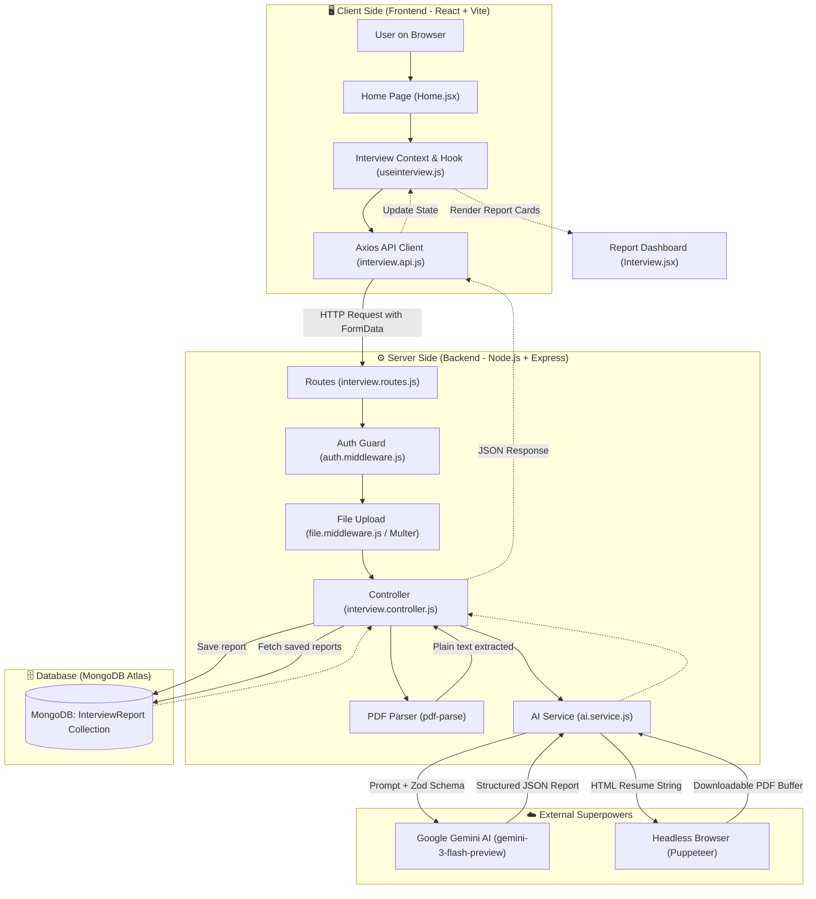
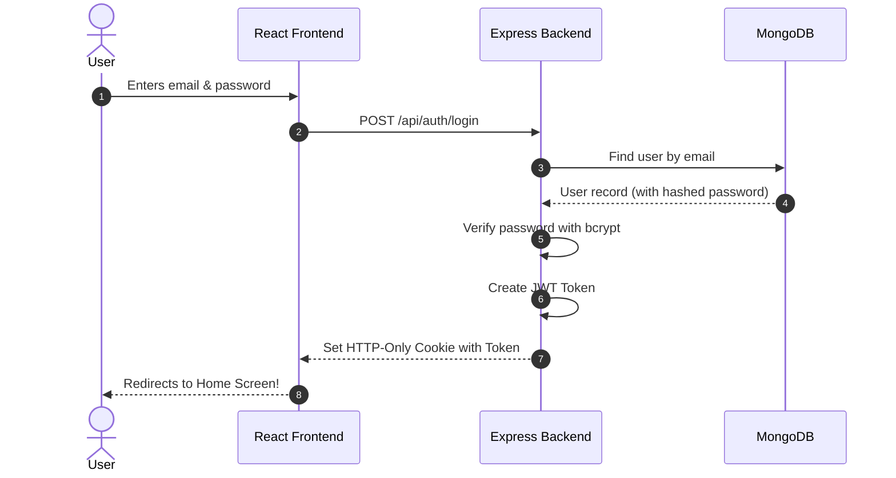

# 🤖 ResumeAI 

Welcome to **ResumeAI**! 🎉  
This project is an **AI-powered Career Assistant**. It takes a job description and a person's resume, uses smart AI (Google Gemini) to analyze them, tells the candidate their match score, asks them practice interview questions, gives them a day-by-day study roadmap, and can even generate a tailored resume PDF!

---

## 🍕 The Big Picture: Think of ResumeAI Like a Pizza Restaurant!

To understand how all these files talk to each other, imagine you are visiting a high-tech pizza restaurant:

```
+-----------------------------------------------------------------------------------------+
|                                    THE RESTAURANT METAPHOR                              |
+-----------------------------------------------------------------------------------------+
|  1. THE CUSTOMER (User)           - You, sitting at the table with a web browser.       |
|  2. THE WAITER & MENU (Frontend)  - React app that looks pretty, shows forms & buttons. |
|  3. THE KITCHEN MANAGER (Backend) - Node.js + Express server receiving orders.          |
|  4. THE PANTRY (MongoDB Database) - Where all recipes and customer orders are stored.   |
|  5. THE MASTER CHEF (Gemini AI)   - Google Gemini creating custom interview answers.    |
|  6. THE COLOR PRINTER (Puppeteer) - Prints the generated resume into a beautiful PDF.   |
+-----------------------------------------------------------------------------------------+
```

1. **You (The User)** open the website in your browser.
2. **The Waiter (Frontend - React)** shows you a nice screen where you paste a job description and upload your resume PDF.
3. When you click **"Generate Strategy"**, the Waiter takes this order and runs back to **The Kitchen (Backend - Express)**.
4. **The Kitchen Manager (Express Server)** opens up the resume file and reads the text inside it.
5. The Kitchen sends this information to **The Master Chef (Google Gemini AI)** and asks:  
   *"Hey Chef! How well does this candidate fit this job? What questions will they be asked? How should they prepare?"*
6. **The Master Chef** replies with a clean, structured JSON plan (Match score, questions, day-by-day roadmap).
7. The Kitchen saves this report in **The Pantry (MongoDB database)** so it is never lost.
8. If you want a tailored resume, **The Color Printer (Puppeteer)** converts the AI-designed HTML into a real PDF and hands it to you to download!

---

## 🗺️ System Architecture Diagram

Here is how data travels across the entire application:



---

## 🔄 User Journey & Feature Workflows

### 1. 🔐 Sign Up & Login (The Security Badge)
1. You register with a username, email, and password.
2. The server encrypts your password with **bcrypt** (scrambles it so even database administrators cannot read it).
3. The server generates a **JWT (JSON Web Token)** — think of it like a VIP wristband stamped with your User ID.
4. This wristband is stored inside an **HTTP-only cookie** in your browser.
5. Whenever you make a request, your browser automatically shows this cookie so the server knows who you are!



---

### 2. 🎯 Generating an Interview Plan
1. You paste the job description (e.g. *"React Developer at Netflix"*).
2. You select your resume PDF file (optional: or write a quick self-description).
3. You click **"Generate My Interview Strategy"**.
4. The server receives the PDF, reads the words using `pdf-parse`.
5. It asks Google Gemini using a strict schema (built with `zod`) so Gemini always gives back:
   - `matchScore` (0 to 100)
   - `technicalQuestions` (with reasons and sample answers)
   - `behavioralQuestions`
   - `skillGaps` (low, medium, high)
   - `preparationPlan` (Day 1, Day 2, etc.)
   - `title`
6. The report is saved to MongoDB and returned to your screen.
7. The browser takes you to `/interview/:id` to explore your strategy!

---

### 3. 📄 Downloading a Tailored Resume PDF
1. On the interview page, click **"Download Resume"**.
2. Frontend asks the backend: `POST /api/interview/resume/pdf/:id`.
3. Backend asks Gemini to format a professional, human-sounding, ATS-friendly HTML resume.
4. Backend opens a hidden Chrome browser using **Puppeteer**, renders the HTML, prints it to PDF, and sends the raw file back.
5. Your browser automatically downloads `resume_<id>.pdf`!

---

## 📁 File-by-File Guide: What Every File Does & Why It Exists

Here is a simple directory map of the entire project:

```
resumeai/
├── README.md                          <-- You are here!
├── package.json                       <-- Workspace setup
│
├── backend/                           <-- THE KITCHEN (Server)
│   ├── .env                           <-- Secret keys (MongoDB link, Gemini Key, JWT Secret)
│   ├── package.json                   <-- Backend dependencies
│   ├── server.js                      <-- The power switch that turns on the server
│   └── src/
│       ├── app.js                     <-- Main Express application setup
│       ├── config/
│       │   ├── database.js            <-- Connects to MongoDB
│       │   └── models/
│       │       ├── user.model.js      <-- Blueprint for user accounts
│       │       ├── blacklist.model.js <-- Blueprint for logged-out tokens
│       │       └── interviewReport.model.js <-- Blueprint for interview reports
│       ├── controllers/
│       │   ├── auth.controller.js     <-- Brains for signup, login, logout
│       │   └── interview.controller.js<-- Brains for processing resumes & reports
│       ├── middlewares/
│       │   ├── auth.middleware.js     <-- Security guard checking VIP cookie
│       │   └── file.middleware.js     <-- Mailman receiving uploaded files (Multer)
│       ├── routes/
│       │   ├── auht.routes.js         <-- URLs for authentication (/api/auth)
│       │   └── interview.routes.js    <-- URLs for interviews (/api/interview)
│       └── serves/
│           └── ai.service.js          <-- Talks to Gemini AI and Puppeteer PDF
│
└── frontend/                          <-- THE DINING ROOM (User Interface)
    ├── package.json                   <-- Frontend dependencies
    ├── vite.config.js                 <-- Vite speed optimizer & dev server
    ├── index.html                     <-- The single HTML page hosting the app
    ├── src/
    │   ├── main.jsx                   <-- Starting point of the React app
    │   ├── App.jsx                    <-- Wraps the app in Context Providers
    │   ├── app.routes.jsx             <-- Road signs deciding which page to show
    │   └── style.scss                 <-- Global styling rules
    └── features/
        ├── auth/
        │   ├── auth.context.jsx       <-- Remembers who is logged in across the app
        │   ├── components/
        │   │   └── protected.jsx      <-- Guard bouncing logged-out users to /login
        │   ├── hooks/
        │   │   └── useAuth.js         <-- Easy shortcut hook to call login/register
        │   ├── pages/
        │   │   ├── login.jsx          <-- Login form screen
        │   │   └── register.jsx       <-- Register form screen
        │   └── services/
        │       └── auth.api.jsx       <-- Axios calls sending login/signup to server
        └── interview/
            ├── interview.context.jsx  <-- Remembers the current interview report & list
            ├── hooks/
            │   └── useinterview.js    <-- Easy shortcut hook to generate/fetch reports
            ├── pages/
            │   ├── Home.jsx           <-- The main page with job input & file upload
            │   └── Interview.jsx      <-- The 3-panel dashboard showing results
            ├── services/
            │   └── interview.api.js   <-- Axios calls to /api/interview endpoints
            └── style/
                ├── home.scss          <-- Styling for the Home page card & upload
                └── interview.scss     <-- Styling for the 3-panel results dashboard
```

---

### 📦 Backend Files in Detail

| File | What does it do in plain English? | Who does it talk to? |
| :--- | :--- | :--- |
| **`server.js`** | The "on" button. Loads environment variables from `.env`, connects to MongoDB, and tells Express to start listening on port 3000. | `src/app.js`, `src/config/database.js` |
| **`src/app.js`** | Sets up the Express framework: allows incoming JSON data, reads cookies, enables CORS (so React can talk to it), and plugs in the routes. | `auht.routes.js`, `interview.routes.js` |
| **`src/config/database.js`** | Handles connecting to your cloud MongoDB Atlas database. Prints `"Connected to MongoDB"` when successful. | Called by `server.js` |
| **`src/config/models/user.model.js`** | Tells MongoDB what a User looks like: `username`, `email`, and encrypted `password`. | Used by `auth.controller.js` |
| **`src/config/models/blacklist.model.js`** | Stores logged-out tokens so nobody can reuse an old token if they stole it. Automatically expires after 1 hour. | Used by `auth.controller.js` |
| **`src/config/models/interviewReport.model.js`** | The database blueprint for an interview report: match score, title, questions, answers, and study days. | Used by `interview.controller.js` |
| **`src/middlewares/auth.middleware.js`** | The security guard. Checks the cookie on incoming requests. If the token is valid, it attaches `req.user` and lets you through (`next()`). If not, it stops you with a 401 Unauthorized. | Used by protected routes |
| **`src/middlewares/file.middleware.js`** | Uses `multer` to accept uploaded PDF files directly into computer memory (`memoryStorage`) up to 10MB so we can read it instantly. | Used in `interview.routes.js` |
| **`src/serves/ai.service.js`** | The bridge to Google Gemini AI. Uses the official `@google/genai` SDK with strict schemas defined by `zod`. Also runs `puppeteer` to convert HTML into a PDF file. | Called by `interview.controller.js` |
| **`src/controllers/auth.controller.js`** | Contains 4 functions: `registerUserController`, `loginUserController`, `logoutUserController`, and `getMeController`. | Called by `auht.routes.js` |
| **`src/controllers/interview.controller.js`** | The chef in charge of interviews. Receives the uploaded resume PDF, extracts text using `pdf-parse`, calls `ai.service.js`, saves to MongoDB, and returns JSON. | Called by `interview.routes.js` |
| **`src/routes/auht.routes.js`** | Defines URLs: `POST /register`, `POST /login`, `POST /logout`, `GET /get-me`. | Plugs into `app.js` |
| **`src/routes/interview.routes.js`** | Defines URLs: `POST /` (generate), `GET /` (list reports), `GET /report/:interviewId`, and `POST /resume/pdf/:interviewReportId`. | Plugs into `app.js` |

---

### 🎨 Frontend Files in Detail

| File | What does it do in plain English? | Who does it talk to? |
| :--- | :--- | :--- |
| **`src/main.jsx`** | The root entry point that renders the React tree into `<div id="root"></div>` in `index.html`. | `App.jsx` |
| **`src/App.jsx`** | Wraps the entire website in two big protective blankets: `AuthProvider` (auth memory) and `InterviewProvider` (interview memory). | `app.routes.jsx` |
| **`src/app.routes.jsx`** | The traffic director. Defines what component to show for each URL: `/` (Home), `/login`, `/register`, `/interview/:interviewId`. Wraps private pages in `<Protected>`. | `Home.jsx`, `Interview.jsx`, `login.jsx`, `register.jsx` |
| **`features/auth/auth.context.jsx`** | Stores the currently logged-in user in React state (`user`). On page load, it checks `/api/auth/get-me` so you stay logged in after refreshing! | Used by `useAuth.js` |
| **`features/auth/components/protected.jsx`** | A bouncer. If `user` is null and not loading, it immediately redirects you to `/login`. | Wraps protected routes in `app.routes.jsx` |
| **`features/auth/hooks/useAuth.js`** | A custom React hook giving components easy functions: `handleLogin`, `handleRegister`, `handleLogout`, `user`, `loading`. | Used by login & register pages |
| **`features/interview/interview.context.jsx`** | Global storage for the interview feature: holds `report`, `reports` list, and `loading` spinner state. | Used by `useinterview.js` |
| **`features/interview/hooks/useinterview.js`** | A custom hook providing: `generateReport()`, `getReportById()`, `getReports()`, and `getResumePdf()`. | Used by `Home.jsx` & `Interview.jsx` |
| **`features/interview/pages/Home.jsx`** | The main dashboard where users paste a job description, drag & drop a resume, and click generate. Also lists their recent reports! | Calls `useInterview()` |
| **`features/interview/pages/Interview.jsx`** | The 3-panel results screen: Left panel switches between Technical Questions, Behavioral Questions, and Road Map. Center panel shows accordion question cards. Right panel shows the match score ring and skill gaps! | Calls `useInterview()` |
| **`features/interview/services/interview.api.js`** | Axios HTTP client configured with `withCredentials: true` so auth cookies are sent automatically with every request to `http://localhost:3000`. | Talks to backend `/api/interview` |

---

## 🚀 How to Run the Project Locally

### Prerequisites
- [Node.js](https://nodejs.org/) installed (v18 or higher recommended).
- A free MongoDB database connection string (from [MongoDB Atlas](https://www.mongodb.com/cloud/atlas)).
- A free Google Gemini API key (from [Google AI Studio](https://aistudio.google.com/)).

---

### Step 1: Set up Backend `.env`
In `backend/`, ensure you have a file named `.env` with:

```env
PORT=3000
MONGO_URI=your_mongodb_connection_string_here
JWT_SECRET=any_random_secure_secret_key_here
GEMINI_KEY=your_gemini_api_key_here
```

---

### Step 2: Start the Backend Server
Open a terminal in the `backend/` directory:

```bash
cd backend
npm install
npm run dev
```

You should see:
```
Server is running on port 3000
Connected to MongoDB
```

---

### Step 3: Start the Frontend App
Open a second terminal in the `frontend/` directory:

```bash
cd frontend
npm install
npm run dev
```

You will see:
```
  VITE v...  ready in 500 ms
  ➜  Local:   http://localhost:5173/
```

Open `http://localhost:5173` in your browser. Register an account, log in, paste any job description, and watch the AI build your interview strategy! 🎉

---

## 💡 Summary of Key Technologies Used
- **Frontend**: React 19, Vite, React Router v7, Sass (SCSS), Axios.
- **Backend**: Node.js, Express 5, Mongoose (MongoDB ODM), Multer, pdf-parse, Puppeteer.
- **Artificial Intelligence**: Google Gemini Generative AI SDK (`@google/genai`) with `gemini-3-flash-preview` and `zod` for structured JSON schema validation.
- **Security**: JSON Web Tokens (JWT) in secure HTTP-only cookies, password hashing with bcrypt, and token blacklisting on logout.
